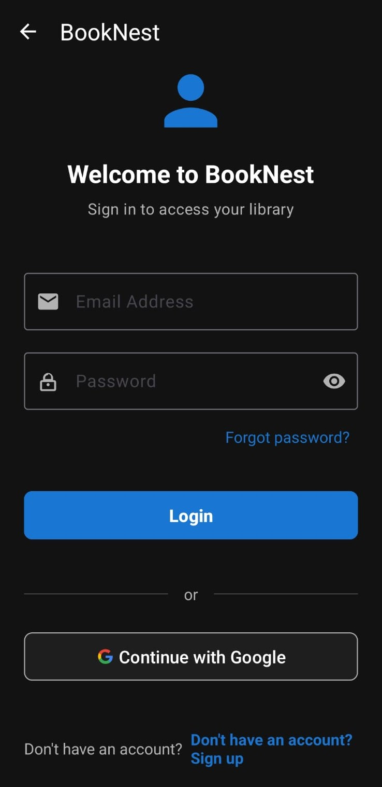
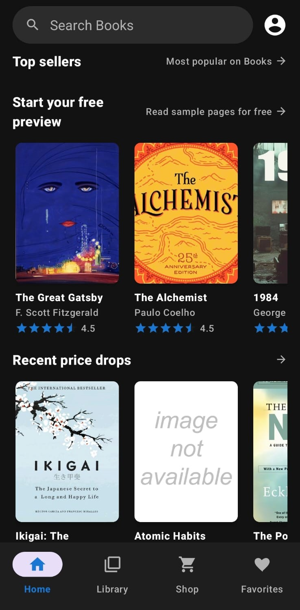
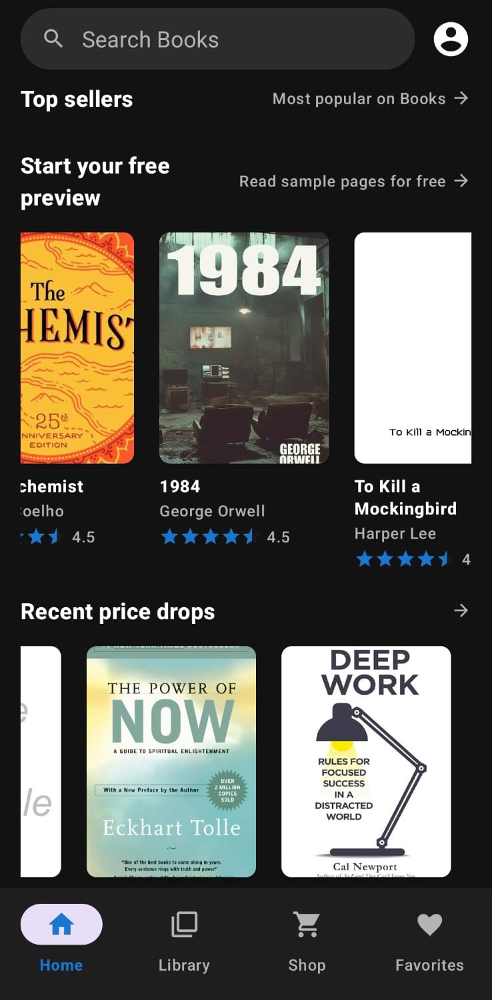
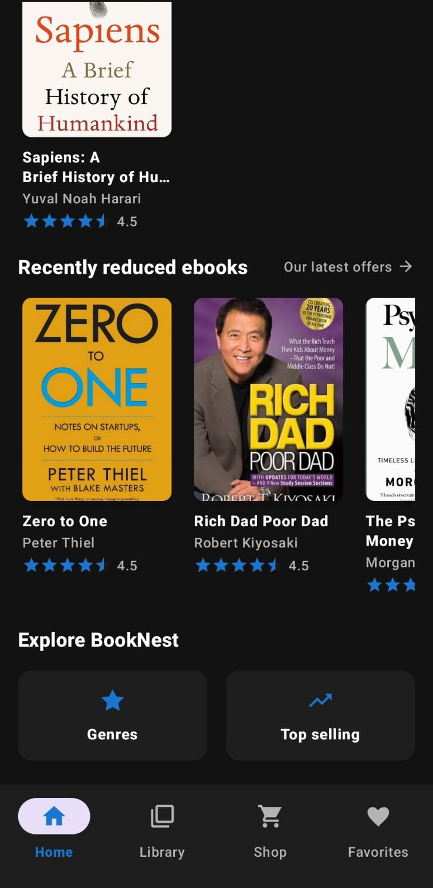

# 📚 BookNest – Android E-Library App

BookNest is a modern **E-Library Android application** built using **Java (Android)** with **Firebase** integration.  
It allows users to explore, purchase, and manage their collection of books with features like **authentication, favorites, and personal library management**.

---

## 🚀 Features

- 🔐 **User Authentication**  
  - Email & Password login  
  - Google Sign-In support  

- 🏠 **Home Dashboard**  
  - Categories like **Top Sellers, Current Reads, Free Previews, Offers**  
  - Horizontal book lists for smooth browsing  

- 📖 **Explore & Shop**  
  - Search & discover books  
  - View latest offers, discounts, and ratings  

- ❤️ **Favorites Section**  
  - Save books to personal favorites list  

- 📚 **My Library**  
  - Manage purchased & saved books  
  - Organized by categories  

- 👤 **User Profile & Settings**  
  - Manage account details  
  - Privacy Policy & Terms of Service  

- 📱 **Modern Android UI**  
  - Material Design components  
  - Bottom Navigation (Home, Library, Shop, Favorites)  
  - Smooth RecyclerView scrolling  

---

## 🛠 Tech Stack

- **Language:** Java  
- **Framework:** Android SDK  
- **Database:** Firebase Realtime Database & Firestore  
- **Authentication:** Firebase Authentication  
- **Cloud Storage:** Firebase Cloud Storage  
- **Libraries & Tools:**  
  - Glide (Image Loading)  
  - RecyclerView & CardView  
  - Material Components  

---

## 📸 Screenshots  

| Login Screen | Home | Favorites |
|--------------|------|-----------|
|  |  |  |

| Profile & Settings | Bookstore | Explore |
|---------------------|-----------|---------|
|  |  |  |

---

## 📦 Installation & Setup

1. Clone this repository  
   ```bash
   git clone https://github.com/RohitManvar/booknest-android.git
   cd booknest-android
   
   Open project in Android Studio

2. Connect with Firebase

    Enable Firebase Authentication (Email/Password & Google)

    Setup Firebase Realtime Database or Firestore

    Enable Cloud Storage

 3. Build & Run on Android Emulator or Device
